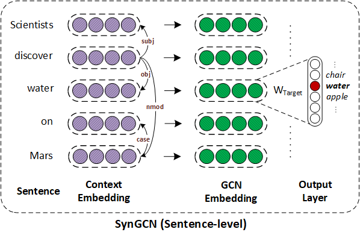
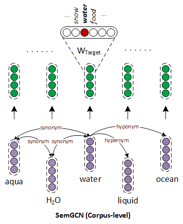

## Incorporating Syntactic and Semantic Information in Word Embeddings using Graph Convolutional Networks

Source code for [ACL 2019](http://acl2019.org) submission: Incorporating Syntactic and Semantic Information in Word Embeddings using Graph Convolutional Networks.

​    		   {:height="1000px" width="500px"}   

*Overview of SynGCN: SynGCN employs Graph Convolution Network for utilizing dependency context for learning word embeddings. For each word in vocabulary, the model learns its representation by aiming to predict each word based on its dependency context encoded using GCNs. Please refer Section 5 of the paper for more details.*

### Dependencies

- Compatible with TensorFlow 1.x and Python 3.x.
- Dependencies can be installed using `requirements.txt`.

### Dataset:

- We used [Wikipedia corpus](https://dumps.wikimedia.org/enwiki/20180301/). The processed version can be downloaded from [here](https://drive.google.com/file/d/1S1UYXc3PfoNFcNY6tB5ahiugXh5qidz-/view?usp=sharing).

- The processed dataset includes:

  - `voc2id.txt` mapping of words to to their unique identifiers.
  - `word2freq.txt` contains frequency of words in the corpus.
  - `de2id.txt` mapping of dependency relations to their unique identifiers. 
  - `data.txt` contains the entire Wikipedia corpus with each sentence of corpus stored in the following format:

  ```java
  <num_words> <num_dep_rels> tok1 tok2 tok3 ... tokn dep_e1 dep_e2 .... dep_em
  ```

  - Here, `num_words` is the number of words and `num_dep_rels`  denotes the number of dependency relations in the sentence.
  - `tok_1, tok_2 ...` is the list of tokens in the sentence and `dep_e1, dep_e2 ...`is the list of dependency relations where each is of form `source_token|destination_token|dep_rel_label`.

### Training SynGCN embeddings:

- Download the processed Wikipedia corpus ([link](https://drive.google.com/file/d/1S1UYXc3PfoNFcNY6tB5ahiugXh5qidz-/view?usp=sharing)) and extract it in `./data` directory.

- Execute `make` to compile the C++ code for creating batches.

- To start training run:

  ```shell
  python syngcn.py -name test_embeddings -gpu 0
  ```

* The trained embeddings will be stored in `./embeddings` directory with name `test_embeddings` .

### Fine-tuning embedding using SemGCN:

{:height="1000px" width="500px"}

- Pre-trained 300-dimensional `SynGCN` embeddings can be downloaded from [here](https://drive.google.com/open?id=17wgNSMkyQwVHeHipk_Mp3y2Q0Kvhu6Mm). 

- For incorporating semantic information in given embedding run:

  ```shell
  python semgcn.py -embed ./embeddings/pretrained_embed.txt -semantic synonyms -embed_dim 300 -name fine_tuned_embeddings -gpu 0
  ```

- The fine-tuned embeddings will be saved in `./embeddings` directory with name `fine_tuned_embeddings`. 